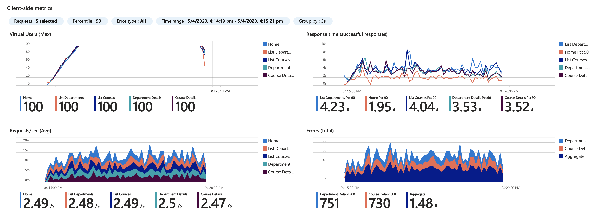

# Azure Load Testing and Azure Kubernetes Service Demo

This demo project showcases an automated load testing solution for Azure Kubernetes Service that acts as a release gate for a minimal SLO (Service Level Objective). There is also an example of a test configuration matrix for using Azure Load Testing to identify a right-size Pod configuration.

The application is a simple web application based on the [Deploy an Azure Kubernetes Service cluster using the Azure CLI](https://learn.microsoft.com/azure/aks/learn/quick-kubernetes-deploy-cli) quick start tutorial.

## Features

This project framework provides the following features:

* [Example GitHub Actions workflow](.github/workflows/cicd.yml) to staging an image, running a load test and then promoting the image to a production deployment in AKS.
* [Example GitHub Actions workflow](.github/workflows/matrix_test.yml) for periodically running a load test matrix to identify a right-size Pod configuration.

## Getting Started

### Prerequisites

* An [Azure Subscription](https://azure.microsoft.com/free/)
* An [Azure Kubernetes Service](https://learn.microsoft.com/azure/aks/) cluster
* An [Azure Container Registry](https://learn.microsoft.com/azure/container-registry/) instance
* An [Azure Load Testing](https://learn.microsoft.com/azure/load-testing/) instance

#### Set environment variables

Set some environment variables that we will use throughout.

```bash
RG_NAME=aks-load-test-demo
REGION=westus2
[[ -z "$RANDOM_STR" ]] && RANDOM_STR=$(openssl rand -hex 3)
# RANDOM_STR='bd1afc'
ACR_NAME="$acr${RANDOM_STR}"
AKS_NAME=aks-demo-1
ALT_NAME=alt-demo
SP_NAME=loadtesting
```

#### Create a Resource Group

```bash
az group create \
    --name $RG_NAME \
    --location $REGION
```

Note: the option `--enable-cluster-autoscaler` can be added to the aks create command to enable node pool autoscaling.

#### Create an Azure Container Registry

```bash
az acr create \
    --resource-group $RG_NAME \
    --name $ACR_NAME \
    --sku basic
```

#### Create an Azure Kubernetes Service cluster

Create an AKS cluster with 2 nodes, a managed identity and [attach the ACR instance](https://learn.microsoft.com/azure/aks/cluster-container-registry-integration?tabs=azure-cli).

```bash
az aks create \
    --resource-group $RG_NAME \
    --name $AKS_NAME \
    --location $REGION \
    --enable-managed-identity \
    --node-count 2 \
    --enable-addons monitoring \
    --enable-msi-auth-for-monitoring  \
    --generate-ssh-keys \
    --attach-acr $ACR_NAME \
    --enable-azure-rbac
```

#### Create an Azure Load Testing instance

```bash
az load create \
    --resource-group $RG_NAME \
    --name $ALT_NAME \
    --location $REGION
```

#### Create a Service Principal

Create a service principal within the scope of the new resource group.

```bash
SUBSCRIPTION_ID=$(az account show --query "id" -o tsv)

az ad sp create-for-rbac \
    --name $SP_NAME \
    --role contributor \
    --scopes /subscriptions/$SUBSCRIPTION_ID/resourceGroups/$RG_NAME \
    --sdk-auth

# Copy the SDK output for the GitHub Action
```

Next, give the service principal contributor rights to the load testing resource. See [details](https://learn.microsoft.com/azure/role-based-access-control/built-in-roles#azure-kubernetes-service-contributor-role) if you want to assign custom roles here.

```bash
OBJECT_ID=$(az ad sp list --filter "displayname eq '${SP_NAME}'" --query "[0].id" -o tsv)

az role assignment create \
    --assignee $OBJECT_ID \
    --role "Azure Kubernetes Service Contributor Role" \
    --scope /subscriptions/$SUBSCRIPTION_ID/resourceGroups/$RG_NAME \
    --subscription $SUBSCRIPTION_ID
```

This step gives access to the GitHub Actions workflow to write to the cluster (make changes to the configuration via `kubectl apply`) and create load tests.

Next, create a second service principal with access to publish to the Azure Container Registry. This will have a username/password that needs to be copied to GitHub secrets (see next section).

```bash
SERVICE_PRINCIPAL_NAME=${SP_NAME}-docker
ACR_REGISTRY_ID=$(az acr show --name $ACR_NAME --query "id" --output tsv)
PASSWORD=$(az ad sp create-for-rbac --name $SERVICE_PRINCIPAL_NAME --scopes $ACR_REGISTRY_ID --role acrpull --query "password" --output tsv)
USER_NAME=$(az ad sp list --display-name $SERVICE_PRINCIPAL_NAME --query "[].appId" --output tsv)

# Copy these values to GitHub Secrets.
echo "ACR_LOGIN: $USER_NAME"
echo "ACR_SECRET: $PASSWORD"
```

### Configuring

The following secrets are required for the GitHub Actions workflow:

* `AZURE_CREDENTIALS` - An SDK service principal created in the [Create a Service Principal](#create-a-service-principal) step
* `AZURE_RESOURCE_GROUP_NAME` - The resource group with the Load Testing instance (`$RG_NAME`)
* `AZURE_LOAD_TEST_NAME` - The name of the Azure Load Testing instance (`$ALT_NAME`)
* `ACR_LOGIN` and `ACR_SECRET` - Azure Container Registry credentials.
* `ACR_NAME` - The name of the ACR resource (`$ACR_NAME`)
* `AKS_NAME` - The name of the AKS cluster (`$AKS_NAME`)

## Demo

The matrix test is run manually, go to Actions, "Test AKS Configuration" and click the `Run Workflow` button.

The test will take around 1 hour to complete. Once this is completed, you can go to Azure Load Testing portal to compare configurations.



The CI/CD workflow will run automatically whenever code is committed to the main branch.

### Adding AKS resource consumption to the Azure Load Testing comparison UI

Edit the Load Test, go to _Configure_->_App Components_ then add filters for the resource group and add the AKS component.


Next, within the Load Test edit panel, click _Configure_->_Metrics_ and add the following metrics:


* `Microsoft.ContainerService/ManagedClusters` `kube_node_status_allocatable_cpu_cores` (Average)
* `Microsoft.ContainerService/ManagedClusters` `kube_node_status_memory_bytes` (Average)
* `Microsoft.ContainerService/ManagedClusters` `kube_pod_status_ready` (Total)
* `Microsoft.ContainerService/ManagedClusters` `node_cpu_usage_percentage` (Average)

All tests run after this change will have the AKS metrics in the Test Run Details pane:


## Resources

* [AKS and ACR Integration](https://learn.microsoft.com/azure/aks/cluster-container-registry-integration?tabs=azure-cli)
* [Deploy an Azure Kubernetes Service cluster using the Azure CLI](https://learn.microsoft.com/azure/aks/learn/quick-kubernetes-deploy-cli)
* [Integrate Azure Load Testing into GitHub Actions (Video)](https://learn.microsoft.com/shows/devops-lab/integrate-azure-load-testing-into-github-actions)
* [Azure Load Testing GA blog](https://aka.ms/MALT-GA)
* [Azure Load Testing Resources](https://learn.microsoft.com/users/annaso/collections/rqznsygr4qgnyw)
* [Azure Container Registry authentication with service principals](https://learn.microsoft.com/azure/container-registry/container-registry-auth-service-principal)
